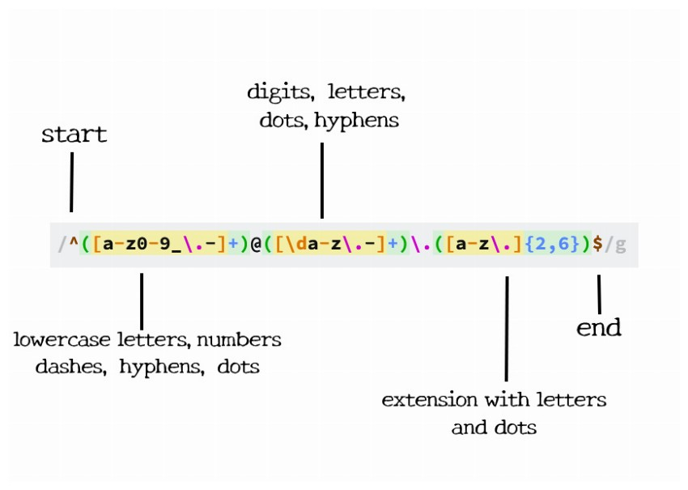

  

# Regular Expressions: Email Validation

Regular expressions, or regex, is a key tool in programming. They help find specific patterns in text. 

## Summary

This tutorial will focus on breaking down the regular expression `/^([a-z0-9_\.-]+)@([\da-z\.-]+)\.([a-z\.]{2,6})$/`, which is used for validating email addresses. This regex is used to confirm that the email address is in the correct format. We will explore each component of this regex to understand how they contribute to identifying a valid email format.

## Table of Contents

- [Anchors](#anchors)
- [Quantifiers](#quantifiers)
- [OR Operator](#or-operator)
- [Character Classes](#character-classes)
- [Flags](#flags)
- [Grouping and Capturing](#grouping-and-capturing)
- [Bracket Expressions](#bracket-expressions)
- [Greedy and Lazy Match](#greedy-and-lazy-match)
- [Boundaries](#boundaries)
- [Back-references](#back-references)
- [Look-ahead and Look-behind](#look-ahead-and-look-behind)

## Regex Components

### Anchors
`^` and `$` are anchors in this regex. The caret `^` marks the beginning of the string, and the dollar sign `$` marks its end. This ensures that the regex matches the whole string from start to finish.

### Quantifiers
`+` and `{2,6}` are quantifiers. The `+` after `[a-z0-9_\.-]` and `[\da-z\.-]` means "one or more" of the preceding elements. The `{2,6}` after `[a-z\.]` specifies that the top-level domain must be between 2 to 6 characters long.

### OR Operator
Our chosen regex doesn't explicitly use the OR operator (`|`), which is used to match one thing or another.

### Character Classes
`[a-z0-9_\.-]` and `[\da-z\.-]` are character classes. They match any character in the set. `\d` is a special character class that matches any digit.

### Flags
There are no flags used in this regex. Flags, like `g` for global search or `i` for case-insensitive search, modify the behavior of the regex.

### Grouping and Capturing
`([a-z0-9_\.-]+)`, `([\da-z\.-]+)`, and `([a-z\.]{2,6})` are examples of capturing groups. They capture the matches for later use or reference.

### Bracket Expressions
Bracket expressions are denoted by `[...]`. In our regex, `[a-z0-9_\.-]`, `[\da-z\.-]`, and `[a-z\.]` are bracket expressions that define a range of characters to match.

### Greedy and Lazy Match
The quantifiers in our regex are greedy; they match as many occurrences of the pattern as possible. This regex doesn't use lazy matching, which would match as few characters as possible.

### Boundaries
This regex does not include word boundaries like `\b`, which are used to indicate the start or end of a word.

### Back-references
Back-references, used to match the same text as previously matched by a capturing group, are not present in this regex.

### Look-ahead and Look-behind
Look-ahead and look-behind are not used in this regex. They are assertions that check for patterns before or after the current position without including them in the match.

## Author

This tutorial was created by [Marcus Perdue]((https://github.com/marcusperdue)).

    
     
    <a href="https://github.com/marcusperdue">marcusperdue</a>

